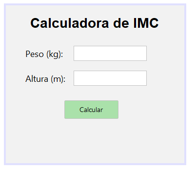

# Calculadora de IMC

Aplicación de escritorio en Java que calcula el Índice de Masa Corporal (IMC) y
su clasificación según la OMS, desarrollada con Swing/Matisse en NetBeans
siguiendo el patrón de diseño MVC.

## Captura del diseño de la interfaz



## Funcionalidad

- Introducir peso (kg) y altura (m).
- Calcular el IMC mediante el botón **Calcular**.
- Mostrar el valor numérico del IMC y su clasificación:
  - Bajo Peso: IMC < 18.5
  - Peso Normal: 18.5 – 24.9
  - Sobrepeso: 25.0 – 29.9
  - Obesidad: ≥ 30.0
- La clasificación cambia de color según el resultado (verde, naranja o rojo).
- Gestión de entradas incorrectas: si el peso o la altura no son números válidos,
  o la altura no está expresada en metros, se muestra un mensaje de error en la
  interfaz en lugar de un resultado.

## Estructura del proyecto (MVC)

```
src/com/calculadora/imc/
├── model/
│   └── CalculadoraIMC.java   → lógica de cálculo y clasificación del IMC
├── view/
│   └── VistaIMC.java         → interfaz gráfica (Swing/Matisse)
├── controller/
│   └── IMCController.java    → conecta la vista con el modelo
└── main/
    └── App.java              → punto de entrada de la aplicación
```

- **Modelo:** no depende de Swing. Contiene únicamente la fórmula del IMC
  (`peso / altura²`) y las reglas de clasificación de la OMS.
- **Vista:** generada con el diseñador de NetBeans (Matisse). Expone sus
  componentes mediante getters, sin lógica de negocio.
- **Controlador:** implementa `ActionListener`, escucha el botón **Calcular**,
  valida la entrada y actualiza la vista con el resultado.
- **Main:** crea la vista y el controlador, y arranca la aplicación.

## Requisitos

- Java JDK 8 o superior.
- NetBeans IDE (para abrir y editar la vista con el diseñador Matisse).

## Cómo ejecutar

1. Abrir el proyecto en NetBeans.
2. Hacer clic derecho sobre `App.java` → **Run File**.
3. Introducir el peso en kilogramos y la altura en metros (por ejemplo, `80` y
   `1,78`).
4. Pulsar **Calcular**.

## Autora

Elena Sáez Lascurain
